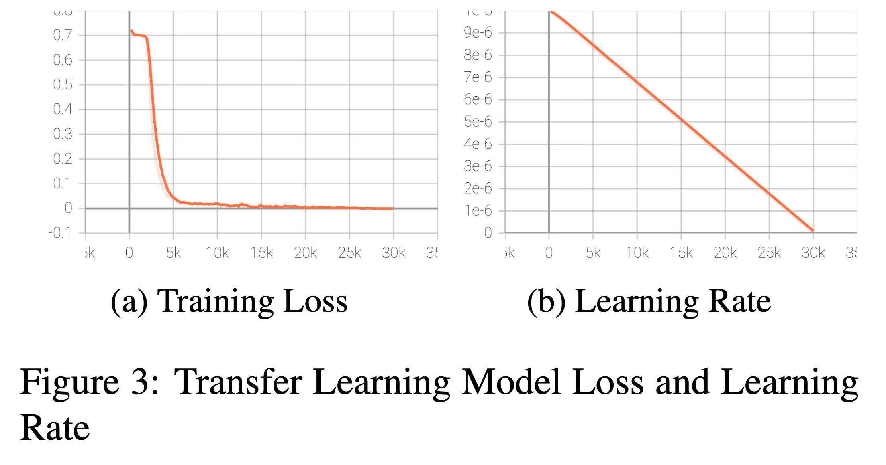

<div align="center">
<h1>Com2Sense Challenge</h1>

<p>Image credits: <a href="https://paperswithcode.com/dataset/com2sense">paperswithcode.com</a></p>
</div>

## Authors

- Ian Conceicao
- Adam Vuilleumier
- Brendan Drury
- Gurbir Arora

## Introduction

In this project we will discuss how we leveraged the large-scale language corpora pretrained model BERT and fine-tuned it for the specific text classification downstream task of evaluating whether statements make common sense or not. We trained and evaluated our model on the Com2Sense data set, and used the Sem-Eval-2020 Task 4 for pretraining. In addition, we implemented a masked language modeling pretrain phrase to get the model familiar with the vocabulary. Finally, we leveraged the natural language processing data augmentation library NL-Augmenter in an attempt to further improve model performance.

## Background

### Com2Sense

Com2Sense evaluates a computer’s ability to judge whether a given statement makes sense according to its understanding of the world and the semantics of the words in the sentence. To do this, Com2Sense makes predictions on statements that are provided in complementary pairs. In other words, for each statement that makes common sense, there is a second sentence that has been slightly modified which makes it nonsensical to a human interpreter.

In addition, we utilized the Sem-Eval-2020 Task 4 to pretrain the Com2Sense task. Similarly to Com2Sense, the Sem-Eval task evaluates whether an NLP model can correctly classify pairs of cor- rect and incorrect statements. However, the Sem- Eval data set also lists possible reasons why the statements are correct or incorrect (Wang et al., 2020).

### Bert

All of our models use BERT (Bidirectional Encoder Representations from Transformers), a model released by Google AI Language researches in 2018, as a starting point to be fine-tuned. BERT’s key innovation is applying transformers to language modeling. Contrary to RNN’s, which read left-to- right or right-to-left, a transformer reads an entire sequence of text at once.

### Masked Language Model

In addition, we also utilized pretraining with a Masked Language Model (MLM). Masked Lan- guage Model is when we give BERT a sentence with a few words missing, and train BERT to pre- dict the complete sentence. Further training with an MLM allows us to fine-tune BERT to better understand a particular domain. On top of this, BERT can learn to predict general linguistic pat- terns and syntax that may be helpful to know (Song et al., 2019).

## Main Methods

### Primary Section

We implemented a checkpoint-best system to record the performance and save the state of our best model in training. In addition, we imple- mented a way to evaluate performance based on the domains of specific Com2Sense statements. Com2Sense domains label which type of reasoning, between temporal, physical, and social, is neces- sary to evaluate a statement.

We implemented a grid-search to determine the best parameter values for weight decay, batch size, and learning rate. For each parameter, we chose 2 possible values, leading to 8 total trials. We also adjusted the number of epochs for each trial to fix the total number of optimization steps to be constant across each trial and to ensure fairness. We tested each model on the dev set.

<div align="center">

</div>

We ran a masked-language-model as a pretraining step to evaluate the potential benefit of a masking step. We also trained a model on the SemEval dataset until convergence and then used it as a starting point for the Com2Sense model to see the potential increase of transfer learning.

### Open Ended Section

In some subfields, data augmentation is utilized to prevent overfitting. For example, in computer vision, images are commonly flipped, rotated or color shifted to normalize the distribution of these features between classes. Data augmentation is less common in natural language processing, owing to the difficulty of creating high-quality synthetic sen- tences. However, recent work has developed new techniques in this area. Since our dataset is rela- tively small, with only 800 examples in the training set for com2sense, we decided to expand it with NL-augment, a recently developed data augmen- tation tool for natural language processing (Dhole et al., 2021). Although this library is intended more for robustness evaluation than expanding training data, as its results are often ungrammatical or have slightly different meaning, the com2sense task is more concerned with sentences’ logical content than their exact syntax or connotation.

NL-augment comes with a suite of over fifty dif- ferent augmentations, but we focused on only five. The ”Synonym Substitution” replaces words with synonyms while the ”Synonym Insertion” adds syn- onyms next to them. In theory, this promotes ro- bustness and creates more diversity in sentences, limiting the potential of overfitting. The ”Change Named Person” transformation randomly changes any names present in a sentence, weakening the model’s ability to try and interpret these names as clues. The ”Tense Transformation” randomly changes a sentence into past, present, or future tense by modifying its verbs, again preventing the model from generalizing based on the tense of in- put sentences. Finally, the ”Antonyms Substitute” transformation replaces an even number of words by their antonyms. This double or quadruple nega- tion theoretically cancels out, leaving the logical content of the sentence similar to the original while changing its structure.

## Main Methods

All listed results were evaluated on the develop-ment data set unless otherwise specified.

### Grid-Search

<div align="center">

</div>

As seen above, when all variables were kept the same, but batch size was increased, 3 out of 4 times the model’s performance decreased. However, our best model, trial-4 was achieved with a batch size of 16. Similarly, when all variables were kept the same, but learning rate was increased, 3 out of 4 times the model’s performance decreased, except for the best trial, trial-4. Lastly, when only the weight decay was increased, half the trials resulted in better performance, and half resulted in worse.

All of these mixed results show selecting the best hyper-parameters is not as easy as increasing or decreasing your variables together because whether a change helps or hurts performance depends on the constant variables. This is why a grid search of every parameter combination is necessary. Our best trial was trial 4, and we used those parameters for the rest of the sections.

<div align="center">

</div>

As we can see in figure 1, for trial-6, accuracy be- gan around 0.497, and quickly increased to a max- imum at around 8k training iterations. However, pairwise accuracy continued to increase nearly up until the final epochs. This shows the model has difficulty distinguishing between complementary statements, and that is where most of the growth occurs later in the trial. This makes sense because by purely guessing the same label every time, the model can achieve 0.50 accuracy - the hard part is increasing pairwise accuracy, because this involves predicting opposite labels for each complement in the pair.

### MLM Pretraining

We ran the masking-task for 15k steps and then switched the same model to the Com2Sense task for 15k more steps. We used the same hyper- parameters as trial-4 because it had the best results on the dev set. This brings the total steps to 30k, which was the same as what we did for our grid- search trials, but just broken up now.

The MLM model had a loss of 0.0499, and a per- plexity of 1.352. The final model had an accuracy of 0.5330 and a pairwise accuracy of 0.1633.

<div align="center">

</div>

As we can see in figure 2 the F1 Score (which is also the accuracy because of the micro-averaging) started at 0.5, compared to 0.497 without the MLM pre-training, and increased to over 0.52. The pair- wise accuracy also quickly increased to 0.16 after only about 5k iterations. The MLM pre-training allowed the model to learn much quicker, and re- sulted in nearly twice the pairwise accuracy.

### SemEval Knowledge Transfer

We trained a model, again with the trial-4 hyper- parameters, on the SemEval data set for 45k itera- tions. This model achieved an accuracy of 0.7889. This accuracy was far higher than any accuracy we ever saw on the Com2Sense task for similar train- ing setups, showing the SemEval task is simpler to learn.

Then, we trained it on the Com2Sense task for 30k more iterations. The model achieved an accu- racy of 0.5578 and a pairwise accuracy of 0.2437 on the dev set and an accuracy of 0.5366 and a pairwise accuracy of 0.2179 on the hidden test set. These metrics are far higher than our previous best on Trial-4, of 0.5251 and 0.2387, respectively, on the dev set. It shows the SemEval task provided a good foundation for a model to learn Com2Sense on. This makes sense because the tasks are very similar, and the SemEval examples serve as sim- pler, extra cases for the model to have. Pre-training on SemEval allowed the model to have a stronger foundation and be more generalizable.

<div align="center">

</div>

In figure 3b, we can observe learning rate de- preciated as a straight line down to 0 from its initial value. This is the expected behavior from the hugging face get linear schedule with warmup. The warmup period is not graphed, but during the warmup period the learning rate increase from 0 to the initial value of 10−6.

Figure 3a shows the training loss throughout the training period. Training loss quickly got close to 0 in about 5k steps, but continued to improve until the end.

### Domain Analysis

<div align="center">

</div>

To determine how well our models performed on each domain of Com2Sense pairs (ie. physi- cal, social, temporal), we analyzed the accuracy of each model on each of the domains separately (4). Across all the models that were not pre-trained with MLM, social was consistently the weakest do- main. This makes sense as social situations require understanding of human emotions, which are not always logical and are often nuanced. For example, it is easier for a model to understand the concept that some objects are bigger than others but much harder for a model to understand that a researcher might feel envy or even loathing towards a col- league who instantly solved a proof that they had been working on for a long time.

The knowledge transfer model performed the best as a whole on all three domains - particularly physical. Since this model was trained on two data sets, it had much more data to solidify its understanding of the relationships between objects of different physical characteristics.

### Open Ended

Each transformation was applied to each of the almost 800 training examples in the Com2Sense dataset, and the same transformation was applied to both elements of the pair each time. This resulted in an augmented training set with over 3400 examples, as some sentences could not be transformed by spe- cific augmentations and had to be skipped. Models that had been trained on the original com2sense data set were then fine-tuned on this new one, which we named ”com2sense-augmented”. The augmented sentences were of fairly low quality, as they were frequently grammatically incorrect or unnatural. However, as previously discussed, this was deemed unlikely to be very important for the com2sense task.

Training on augmented data consistently led to improvements on the dev set. In particular, fine- tuning from the best performing model, which used transfer learning from semeval onto com2sense, resulted in a dev set accuracy improvement from 0.558 to 0.567 and pairwise accuracy improvement from 0.24 to 0.25. It is likely that there would have been similar improvements on the test set, as the model was run with the hyper-parameters previ- ously found by grid search and the dev set results were not used whatsoever in the development of the data augmentation technique.

## Discussion

Looking back on the project, there were a few choices made that we might have done differently given the opportunity to repeat our work:

Firstly, we decided to use micro-averaging to average the scores for each of our trials. After do- ing this for the first few trials, we considered using binary score averaging - which would have made our recall different from our precision, resulting in more useful evaluation metric - but we decided against it in order to have uniformity across our trials. In hindsight, now that we know that micro- averaging is typically only used for multi-class set- tings, we probably should have just scrapped our original trials and re-trained with binary averaging. In any case, since the trials were all run with micro- averaging, the results could still be compared to find the best performing model.

Out of curiosity, we evaluated our best model using binary averaging and obtained a precision of 0.553 and a recall of 0.693. This signifies that this model has a low false negative rate - meaning it is biased in favor of predicting correct.

Secondly, although the data augmentation scheme was able to improve the best model even further, various extensions are possible. The NL- Augment library contained additional transforma- tions, many of which used neural methods to achieve complex paraphrases or sentence reorder- ing. Due to computational and time constraints, we did not use these augmentations, but it is likely that they could have led to bigger gains. A custom aug- mentation tailored specifically to the Com2sense task could likely have yielded the best results. In particular, since many Com2sense examples in- volve numerical comparisons, we could have writ- ten custom logic that created new training examples by tweaking numbers without affecting the relevant comparison.

Lastly, as an extension of this project, we were curious about how these models would perform on Winograd Schemas — a popular alternative to the Turing test. The task is to identify the subject of a verb in a sentence containing a referential ambiguity by using knowledge about the world and the semantics of the sentence. An example of a Winograd Schema is ”The trophy couldn’t fit in the suitcase because it was too big : What was too big? [Trophy — Suitcase]”. It would be interesting to train and evaluate our model on Winograd schemas and how it performs.

## References

Jacob Devlin, Ming-Wei Chang, Kenton Lee, and Kristina Toutanova. 2018. BERT: pre-training of deep bidirectional transformers for language under- standing. CoRR, abs/1810.04805.

Kaustubh D. Dhole, Varun Gangal, Sebastian Gehrmann, Aadesh Gupta, Zhenhao Li, Saad Mahamood, Abinaya Mahendiran, and Simon Mille. 2021. Nl-augmenter: A framework for task- sensitive natural language augmentation. Preprint, abs/2112.02721.

Kaitao Song, Xu Tan, Tao Qin, Jianfeng Lu, and Tie- Yan Liu. 2019. MASS: masked sequence to se- quence pre-training for language generation. CoRR, abs/1905.02450.

Cunxiang Wang, Shuailong Liang, Yili Jin, Yi- long Wang, Xiaodan Zhu, and Yue Zhang. 2020. Semeval-2020 task 4: Commonsense validation and explanation. CoRR, abs/2007.00236.

# Getting Started and Installations <a name="installations"></a>

Please make sure everything is under **Python3**.

We recommend two ways of getting started to setup the necessary environment:

1. Using conda ([miniconda3](https://docs.conda.io/en/latest/miniconda.html)) (preferred).
2. Using python virtual [environment](https://docs.python.org/3/library/venv.html).

## Using Conda

Goto the above link to install the **miniconda3** corresponding to your OS.

Next do the followings:

```bash
# com2sense is the name of the conda environment, you can name it anything you like.
conda create -n com2sense python==3.8

# You can list all the conda envs using the following command.
conda info --envs

# Activate the conda env.
conda activate com2sense

# Initialize.
conda init

# Install the pip in this conda environment.
conda install pip

# And use the following to deactivate the conda environment
# if you're done with some jobs and wish to log out.
conda deactivate
```

And then install all the required packages simply by:

```bash
pip install --upgrade pip

# Install PyTorch, the --no-cache-dir allows you to install on a machine with small RAM
pip3 --no-cache-dir install torch==1.10.1+cu113 torchvision==0.11.2+cu113 torchaudio==0.10.1+cu113 -f https://download.pytorch.org/whl/cu113/torch_stable.html

# The below command will bulk install everything needed.
pip install -r requirements.txt
```

## Using GPUs

When your OS features any GPUs, please only access to one of them as our task is not that heavy, and hence does not need to waste computational resources using multi-GPUs in general (but feel free to do so if you'd like).

```bash
# Check your GPU status, this will print all the essential information about all the GPUs.
nvidia-smi

# Indicating the GPU ID 0.
export CUDA_VISIBLE_DEVICES="0"

# OR, GPU ID 2.
export CUDA_VISIBLE_DEVICES="2"

# For multi-gpu settings, suppose we would like to use 0, 1, 2 (3 GPUs).
export CUDA_VISIBLE_DEVICES="0,1,2"

# For cpu-only, and hence `no_cuda`.
export CUDA_VISIBLE_DEVICES=""
```

# Code Executions <a name="executions"></a>

For basic execution demo, after finishing up all the required `TODO`s in `trainers/*.py`,  
execute the following command:

```bash
sh scripts/train_dummy.sh
```

And immediately you should see training and evaluation loops being successfully executed.

# Datasets <a name="datasets"></a>

All the required `TODO` blocks are in the codes under `data_processing` folder.  
Please refer to the README under `data_processing` folder for data schema and execution examples.

# Training <a name="training"></a>

We have prepared a few scripts for you to use:

```bash
# Script for finetuning a model on Sem-Eval dataset.
sh scripts/train_semeval.sh

# Script for finetuning a model on Com2Sense dataset.
sh scripts/train_com2sense.sh

# Script for running an MLM pretraining on some dataset.
sh scripts/run_pretraining.sh

# Script for loading an MLM-pretrained model and continue finetuning.
sh scripts/finetune_from_pretrain_dummy.sh
```

In any training script, if you comment out (or remove) the `--do_train` argument, then the script will only execute the testing.  
In this case, please ensure the `--iters_to_eval` is properly set to the checkpoint(s) you would like to evaluate.

Other most essential arguments to be aware of and you **SHOULD TRY TO TUNE** are:

- `TASK_NAME` is to be consistent with `data_processing/__init__.py`.
- `DATA_DIR` to be made sure correspond to a proper dataset folder.
- `MODEL_TYPE` should be one of the [model card](https://huggingface.co/models), e.g. `bert-base-cased`
- `model_name_or_path` can be same as `MODEL_TYPE` or a saved directory which contains the checkpoint, e.g. `outputs/pretrain/ckpts/checkpoint-100` for restoring or finetuning a trained checkpoint.
  - Remember that you **CAN ONLY** use one of the following models for training on both Sem-Eval and Com2Sense: `{bert, deberta, roberta}`.
- `tokenizer_name` and `config_name` can be both not specified (hence refer to `model_name_or_path`) or same as `MODEL_TYPE`.
- `per_gpu_train_batch_size` and `per_gpu_eval_batch_size` can be used to tune training/evaluation batch size.
- `learning_rate` tunes the initial learning rate.
- `num_train_epochs` maximum number of epochs to train the model.
- `max_seq_length` the maximum sequence length of inputs to the model.
- `output_dir` where to save your outputs and checkpoints.
- `save_steps` denotes per how many steps we save the models.
- `logging_steps` denotes per how many steps we evaluate the models during training.
- `max_eval_steps` maximum evaluation steps for an evluation split of a dataset.
- `eval_split` the split to be evaluated on, during training it should be `dev` and it should be `test` during testing.
- `iters_to_eval` the iterations of the saved checkpoints to be evaluated on.
  - If you implement saving the best functionality, it can also be `best` instead of a number.

## Visualizing Your Training <a name="tb"></a>

It is often important to visualize your training curves and other essential information during training for troubleshooting problems or ensuring your training is stable (e.g. observing if your training is over/under-fitting).
People often use [TensorBoard](https://pytorch.org/tutorials/recipes/recipes/tensorboard_with_pytorch.html) (the PyTorch compatible version) for this purpose.  
Please check the introduction in the link to get familiar with this very useful tool.

Each execution of your codes will automatically create a subfolder under the folder `runs`, e.g. `runs/Jan01_06-03-20_pluslab-a100_ckpts_dummy` can be a subfolder containing tensorboard events of one of your execution.  
Executing the following command a tensorboard-in-browser will be rendered:

```bash
tensorboard --logdir=the/tensorboard/event/dir

# For example:
tensorboard --logdir=runs/Jan01_06-03-20_pluslab-a100_ckpts_dummy
```

You should see the followings as an output:

```bash
Serving TensorBoard on localhost; to expose to the network, use a proxy or pass --bind_all
TensorBoard 2.7.0 at http://localhost:6006/ (Press CTRL+C to quit)
```

Since the `localhost` is on the server, unless you can directly access to the GUI on the server, you may find this **[SSH Tunneling](https://coderwall.com/p/ohk6cg/remote-access-to-ipython-notebooks-via-ssh)** handy.  
For example, if you execute the following command **on your local terminal**:

```bash
ssh -N -f -L localhost:6006:localhost:6006 your_id@the_server_name
```

Then, open up a browser on your machine and in the search bar enter `http://localhost:6006/` you will see the rendered tensorboard shown up!
